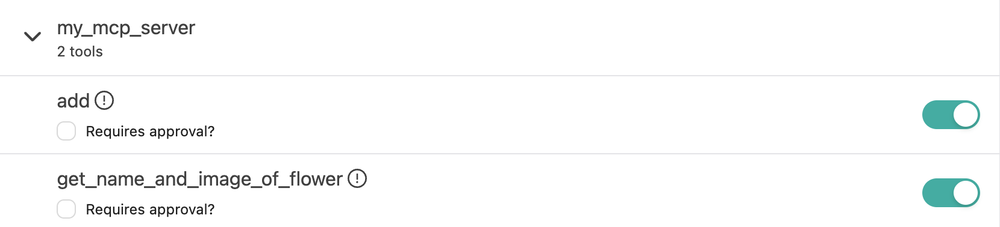
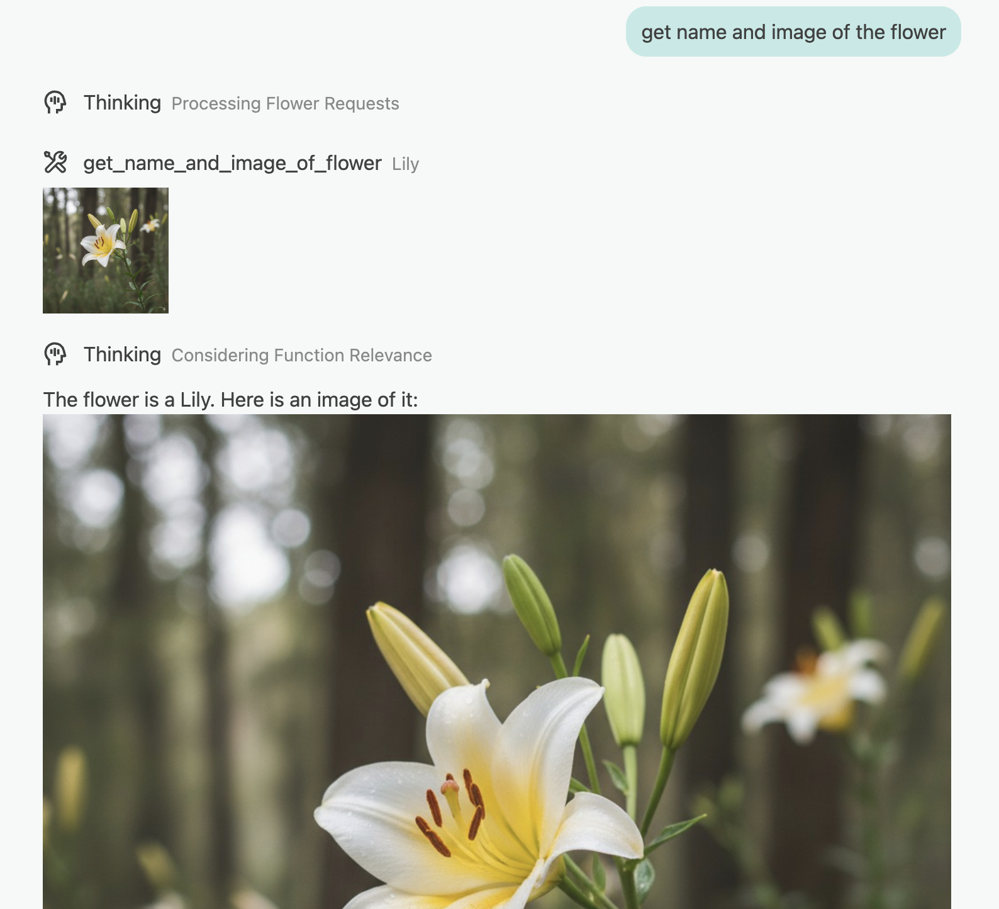

# MCP Server Python Template

A production-ready template for building Model Control Protocol (MCP) servers in Python. This template provides a solid foundation with best practices, proper project structure, and example implementations to help you quickly develop your own MCP server.

## 🚀 Quick Start

### Prerequisites
- Python 3.12+ 
- [uv](https://docs.astral.sh/uv/) package manager (recommended) or pip

### 1. Create Your Repository

**Option A: Use Template (Recommended)**
1. Click the **"Use this template"** button on GitHub page→ **"Create a new repository"** 
2. Name your repository and clone it:
   ```bash
   git clone <your-new-repo-url>
   cd <your-repo-name>
   ```

**Option B: Direct Clone This Repository**

```bash
git clone https://github.com/pathintegral-institute/mcp-server-python-template.git
cd mcp-server-python-template
```

**Create virtual env and activate it**
```bash
uv venv
source .venv/bin/activate # on Unix-like system
# .venv\Scripts/activate # on Windows
```

**Install Dependencies**
```bash
uv sync  # Install dependencies
```


### 2. Install for Development
```bash
uv pip install -e .  # Enables the `uv run mcp-server` command
```

### 3. Run Your Server
```bash
# Method 1: Using the configured script (recommended)
uv run mcp-server

# Method 2: Direct execution
uv run python src/mcp_server/server.py
```

Your MCP server is now running and ready to accept connections!

## 📁 Project Structure

```
mcp-server-python-template/
├── src/mcp_server/           # Main package directory
│   ├── __init__.py          # Package initialization
│   ├── server.py            # FastMCP server entrypoint
│   └── lily.jpeg            # Example static asset
├── pyproject.toml           # Project configuration & dependencies
├── uv.lock                  # Locked dependency versions
├── README.md                # This file
└── AGENTS.md                # Detailed development guidelines for AI Agent
```

## 🛠️ Building Your MCP Server

### Adding New Tools

Tools are the core functionality of your MCP server. Here's how to add them:

1. **Open `src/mcp_server/server.py`**
2. **Add your tool function with the `@mcp.tool()` decorator:**

```python
@mcp.tool()
def your_tool_name(param1: str, param2: int) -> TextContent:
    """Brief description of what this tool does.
    
    Args:
        param1: Description of first parameter
        param2: Description of second parameter
    
    Returns:
        Description of what this returns
    """
    # Your implementation here
    result = f"Processed {param1} with value {param2}"
    return TextContent(type="text", text=result)
```

### Working with Different Content Types

#### Text Content
```python
from mcp.types import TextContent

@mcp.tool()
def get_text_data() -> TextContent:
    return TextContent(type="text", text="Your text here")
```

#### Image Content (from file)
```python
import base64
from mcp.types import ImageContent

@mcp.tool()
def get_image() -> ImageContent:
    with open("path/to/image.jpg", "rb") as f:
        image_data = base64.b64encode(f.read()).decode("utf-8")
    return ImageContent(data=image_data, mimeType="image/jpeg", type="image")
```

#### Multiple Content Types
```python
from typing import List
from mcp.types import TextContent, ImageContent

@mcp.tool()
def get_mixed_content() -> List[TextContent | ImageContent]:
    return [
        TextContent(type="text", text="Here's an image:"),
        ImageContent(data=your_base64_data, mimeType="image/png", type="image")
    ]
```

### Example Tools in This Template

This template includes example tools to get you started:

1. **`add(a: int, b: int)`** - Simple arithmetic operation
2. **`get_name_and_image_of_flower()`** - Returns text and image content

## 🔧 Development Workflow

### Running in Different Modes

#### Standard I/O Mode (Default)
```bash
uv run mcp-server
```

#### HTTP Mode
Uncomment the following line in `server.py`:
```python
# mcp.run(transport="stdio")  # Comment this out
mcp.run(transport="streamable_http")  # Uncomment this
```

Then run:
```bash
uv run mcp-server
```

### Testing Your Tools
#### Use MCP Inspector (Recommended)
You can test and debug your MCP servers by MCP Inspector. Please refer to the [official doc](https://modelcontextprotocol.io/legacy/tools/inspector).


### Add your local MCP server to MCP Client
Take Lucien Desktop as example:


And you should be able to let LLM call your tools:



### Adding Dependencies

Add new dependencies:
```shell
uv add [package_name]
```

the `pyproject.toml` will be updated automatically


## Let Others Use It

Let anyone run your MCP server without cloning or installing globally using uvx:

```bash
uvx --from 'git+https://github.com/[AUTHOR]/[REPO_NAME]@<TAG_OR_BRANCH_OR_SHA>' mcp-server
```

What to fill in:
- `git+https://github.com/[AUTHOR]/[REPO_NAME]`: Your public GitHub repo. The repo must be a valid Python package with a `pyproject.toml`.
- `@<TAG_OR_BRANCH_OR_SHA>`: Optional but recommended. Pin to a release tag (e.g. `@v0.1.0`) for reproducible installs; omit to use the default branch.
- `mcp-server`: The console script name. This template already defines it in `pyproject.toml` as `mcp-server = "mcp_server.server:main"`.

How it works:
- `uvx` creates an isolated, ephemeral environment, installs your package (+ deps from `pyproject.toml`/`uv.lock`), then runs the specified entry point. Nothing is installed globally.

Client usage:
- Most MCP clients let you specify a command to launch a server. Use the same one‑liner above as the command. If your server requires flags, add them after `mcp-server`.
- This template defaults to stdio transport. If you switch to HTTP in `server.py`, configure your client accordingly and ensure the port is reachable.

Tips for maintainers:
- Publish release tags so others can pin versions (stability and cache‑friendly).
- Keep `requires-python` and dependencies up to date; commit `uv.lock` for reproducibility.
- Ensure the entry point remains `mcp-server` (or update documentation if renamed).


## Contributing To Our Registry
We're maintaining [a fully open sourced MCP registry](https://mcpm.sh/registry/). If you're interested in contributing, please check [this doc](https://github.com/pathintegral-institute/mcpm.sh/blob/main/mcp-registry/README.md#1-create-a-github-issue-easiest).

## 📚 Additional Resources

- **[MCP Documentation](https://modelcontextprotocol.io/docs)** - Official MCP documentation
- **[MCP Python SDK](https://github.com/modelcontextprotocol/python-sdk)** Official MCP SDK repo

## 📄 License

MIT Licence

---

**Happy building! 🎉** 

Need help? Check the [issues page](../../issues)
